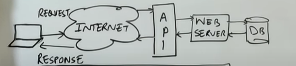
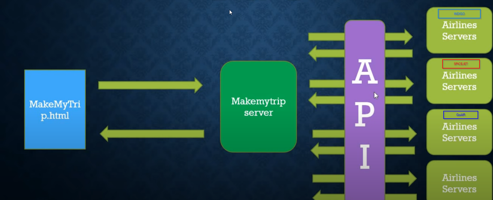
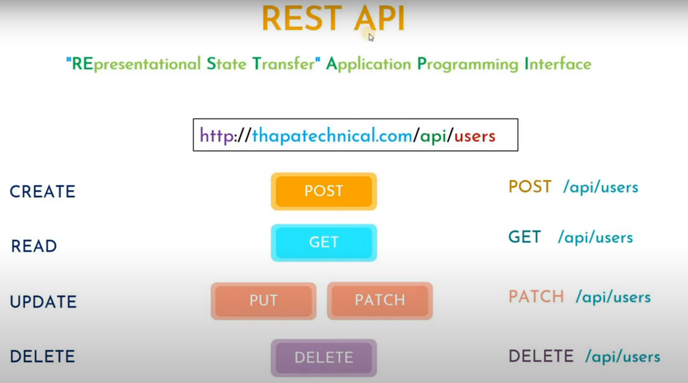

# API

- Application Programming Interface that allows applications to communicate with each other.
  
- It is a messenger that delivers your request to the provider and delivers the response back to you.
  
- A code written by someone else who's giving you permission through API key to use that code
  
- Eg 
  - Singup/Signin Using Google API
  - Zomato/Swiggy using Google Maps API

# Postman

- It is a tool to test the API.
- You can also use ThunderClient Extension of VS Code

# REST API

- Representational State Transfer API 
- It uses HTTP request to access and use data.
- It is stateless

  

- Mandatory things for Rest API:
  - Use of HTTP Verb: GET, POST, PUT, PATCH, DELETE
  - same endpoint

  
